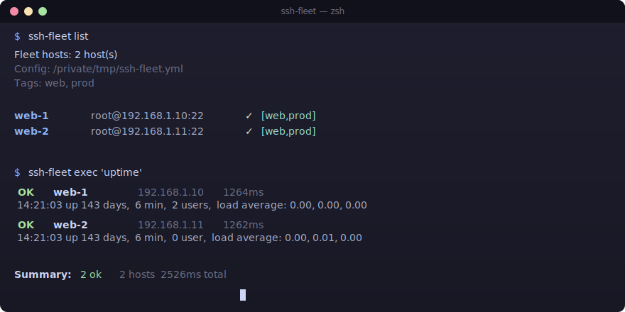

<p align="center">
  <a href="https://github.com/flantofun/ssh-fleet/releases/latest"></a>
  <a href="https://github.com/flantofun/ssh-fleet/blob/main/package.json"></a>
  <a href="https://github.com/flantofun/ssh-fleet/actions/workflows/ci.yml"></a>
  <a href="https://github.com/flantofun/ssh-fleet/blob/main/LICENSE"></a>
  <a href="https://www.npmjs.com/package/ssh-fleet"></a>
  <a href="DEVPOST.md"></a>
</p>

<h1 align="center">SSH Fleet</h1>

<p align="center">
  English | <a href="README_CN.md">简体中文</a>
</p>

<p align="center">
  ⚡ Run commands across all your servers in parallel — from a single, dependency-free CLI.
</p>

<p align="center">
  <a href="#install">Install</a> · <a href="#quick-start">Quick Start</a> · <a href="#commands">Commands</a> · <a href="#configuration">Config</a>
</p>

<p align="center">
  
</p>

---

SSH Fleet is a lightweight Node.js CLI for managing and operating on a fleet of
SSH hosts. Define your servers once in a YAML or JSON file, then execute shell
commands across all (or a subset) of them in parallel, stream results, push or
pull files, and get machine-readable JSON output for scripting.

- 🚀 **Parallel execution** with configurable concurrency
- 📜 **Multi-line scripts** sent directly from a local file
- 🏷️ **Tag-based host selection** (`--hosts tag:prod`)
- 📊 **Multiple output formats** — grouped, combined, JSON, silent
- 🔑 **SSH key + password auth**, agent forwarding support
- 📦 **Zero runtime deps for the CLI itself** — ships as a single bundled file
- 📝 **YAML or JSON config** — your fleet as code
- 🔄 **File transfer** — push/pull via SFTP
- ❤️ **MIT licensed**, TypeScript, thoroughly tested

## Install

```bash
npm install -g ssh-fleet
```

Or run ad-hoc with `npx`:

```bash
npx ssh-fleet exec 'uptime'
```

## Quick start

### 1. Generate a config

```bash
ssh-fleet init
```

This creates `ssh-fleet.yml` in the current directory:

```yaml
defaultUser: root
defaultPort: 22
defaultPrivateKeyPath: /Users/you/.ssh/id_rsa

hosts:
  - name: web-1
    host: 192.168.1.10
    tags: [web, prod]
  - name: web-2
    host: 192.168.1.11
    tags: [web, prod]
  - name: db-1
    host: 192.168.1.20
    user: postgres
    tags: [db, prod]
```

### 2. List your fleet

```bash
ssh-fleet list
```

```
Fleet hosts: 3 host(s)
Config: /path/to/ssh-fleet.yml
Tags: db, prod, web

web-1  root@192.168.1.10:22  ✓  [web,prod]
web-2  root@192.168.1.11:22  ✓  [web,prod]
db-1   postgres@192.168.1.20:22  ✓  [db,prod]
```

### 3. Run a command everywhere

```bash
ssh-fleet exec 'uptime'
```

```
 OK  web-1 192.168.1.10 45ms
 11:51:05 up 142 days, 21:36,  2 users,  load average: 0.08, 0.02, 0.01

 OK  web-2 192.168.1.11 42ms
 11:51:05 up 142 days, 21:36,  0 user,  load average: 0.06, 0.02, 0.00

Summary:  2 ok  2 hosts  87ms total
```

### 4. Health check at a glance

```bash
ssh-fleet status
```

```
 OK  web-1 192.168.1.10 1352ms
=== HOSTNAME ===
web-1
=== UPTIME ===
 11:51:05 up 142 days, 21:36,  2 users,  load average: 0.08, 0.02, 0.01
=== LOAD ===
0.08 0.02 0.01 1/377 964834

 OK  web-2 192.168.1.11 1320ms
=== HOSTNAME ===
web-2
=== UPTIME ===
 11:51:05 up 142 days, 21:36,  0 user,  load average: 0.06, 0.02, 0.00
=== LOAD ===
0.06 0.02 0.00 1/197 1452300

Summary:  2 ok  2 hosts  2672ms total
```

### 5. Target specific hosts

```bash
# By name
ssh-fleet exec 'df -h' --hosts web-1,web-2

# By tag
ssh-fleet exec 'sudo systemctl restart nginx' --hosts tag:web

# All hosts
ssh-fleet exec 'free -m' --hosts all
```

### 6. Transfer files

```bash
# Push a config file to all web servers
ssh-fleet copy push ./nginx.conf /etc/nginx/nginx.conf --hosts tag:web

# Pull logs from a single host (saved with .hostname suffix)
ssh-fleet copy pull /var/log/syslog ./syslog --hosts web-1
```

## Try it without SSH servers

The Docker demo starts two disposable SSH hosts on your machine, so the complete
workflow can be judged without cloud credentials or existing infrastructure.

```bash
npm install && npm run build
docker compose -f examples/docker-demo/compose.yml up -d --build
node dist/cli.js list --config examples/docker-demo/ssh-fleet.yml
node dist/cli.js exec 'hostname && uptime' --config examples/docker-demo/ssh-fleet.yml
node dist/cli.js run examples/docker-demo/health-check.sh --config examples/docker-demo/ssh-fleet.yml
docker compose -f examples/docker-demo/compose.yml down
```

## Commands

### `exec <command>`

Run a shell command on selected hosts.

| Flag | Description | Default |
|------|-------------|---------|
| `--hosts <sel>` | Host selector (names, `tag:xxx`, or `all`) | all |
| `-c, --concurrency <n>` | Max concurrent connections | 8 |
| `--seq` | Run sequentially instead of in parallel | false |
| `-t, --timeout <ms>` | Per-host timeout | none |
| `-o, --output <mode>` | Output: `grouped` / `combined` / `json` / `silent` | grouped |
| `-f, --fail-fast` | Stop on first failure | false |
| `--config <path>` | Path to config file | auto-discovered |

```bash
# JSON output for piping into jq
ssh-fleet exec 'hostname' -o json | jq '.[] | select(.exitCode==0) | .name'
```

### `run <script-file>`

Run a local multi-line shell script on the selected hosts. The script does not
need to be copied to the remote machines first and accepts the same execution
flags as `exec`.

```bash
cat > deploy.sh <<'EOF'
set -e
cd /srv/my-app
git pull --ff-only
npm ci --omit=dev
sudo systemctl restart my-app
EOF

ssh-fleet run ./deploy.sh --hosts tag:web --concurrency 4 --fail-fast
```

### `list`

List hosts in the fleet. Flags: `--verbose`, `--json`, `--tags`.

### `init`

Create a starter config. Flags: `--force`, `--json`, `--path <dir>`.

### `status`

Quick health check — runs `hostname && uptime` on every host.

## Configuration

SSH Fleet searches these locations (first match wins):

1. `./ssh-fleet.yml` / `.ssh-fleet.yml`
2. `./ssh-fleet.yaml` / `.ssh-fleet.yaml`
3. `./ssh-fleet.json` / `.ssh-fleet.json`
4. Parent directories (up to home)
5. `~/.ssh-fleet.{yml,yaml,json}`

### Host fields

| Field | Required | Description |
|-------|----------|-------------|
| `name` | ✅ | Unique identifier |
| `host` | ✅ | Hostname or IP |
| `port` | ❌ | SSH port (default 22) |
| `user` | ❌ | SSH user (falls back to `defaultUser`) |
| `password` | ❌ | Password auth (prefer keys!) |
| `privateKeyPath` | ❌ | Path to private key |
| `passphrase` | ❌ | Passphrase for encrypted key |
| `tags` | ❌ | Array of tags for grouping |

### Top-level defaults

```yaml
defaultUser: root
defaultPort: 22
defaultPrivateKeyPath: ~/.ssh/id_rsa
```

Any host-level field overrides the default.

## Why?

Managing 5, 50, or 500 servers shouldn't mean 500 terminal tabs. Tools like
Ansible are powerful but heavy; SSH Fleet aims to be the **fast, zero-config
layer below that** — the thing you reach for when you just need to run one
command everywhere, right now.

## Comparison

| Feature | ssh-fleet | Ansible | Fabric | pdsh |
|---------|-----------|---------|--------|------|
| Setup | npm i -g | pip + inventory | pip | apt/brew |
| Config | 1 YAML file | inventory + playbooks | Python file | none |
| Parallel | ✓ | ✓ | ✓ | ✓ |
| Zero deps on remote | ✓ | ✗ needs Python | ✗ needs Python | ✓ |
| JSON output | ✓ | ✓ | ✗ | ✗ |
| File transfer | ✓ | ✓ | ✓ | ✗ |
| Lightweight | ✓ (Node.js) | ✗ (Python) | ✗ (Python) | ✓ (C) |

## Roadmap

- [x] `run` command for multi-line scripts from a file
- [ ] Diff mode: show only hosts where output differs
- [ ] Interactive host picker (fzf-style)
- [ ] Docker image for CI pipelines
- [ ] Shell completions (bash, zsh, fish)
- [ ] `top` command for live resource monitoring

## Development

```bash
git clone https://github.com/flantofun/ssh-fleet
cd ssh-fleet
npm install
npm run dev -- list          # run via tsx
npm run build                # compile to dist/
node dist/cli.js exec 'uptime'
```

## Built with Codex + GPT-5.6

SSH Fleet's Build Week iteration was developed with Codex using GPT-5.6. Codex
reviewed the command architecture, implemented the multi-line `run` workflow,
strengthened option validation, added tests, and prepared the reproducible judge
experience. See [CODEX_BUILD_LOG.md](CODEX_BUILD_LOG.md) for the implementation
record and verification evidence.

## License

MIT © 2026 flantofun
